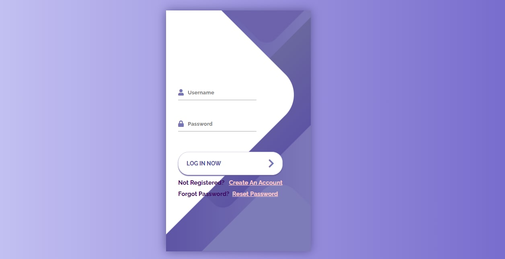
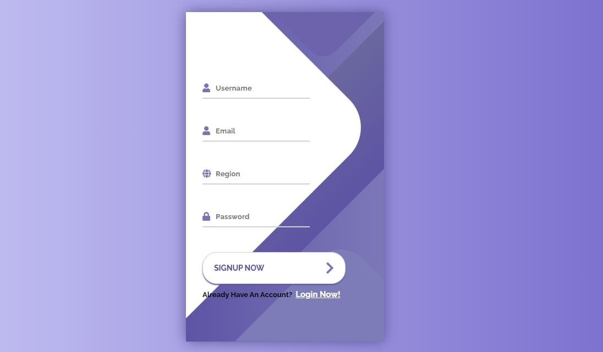
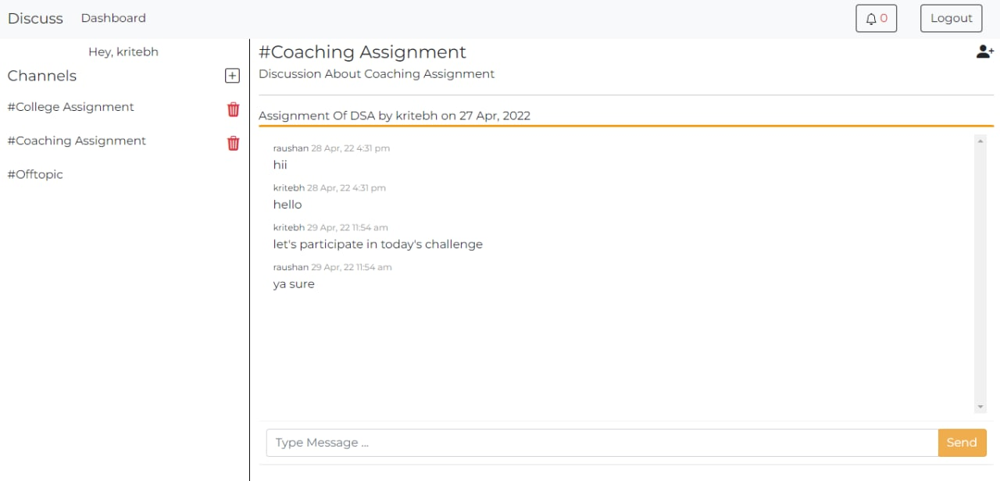
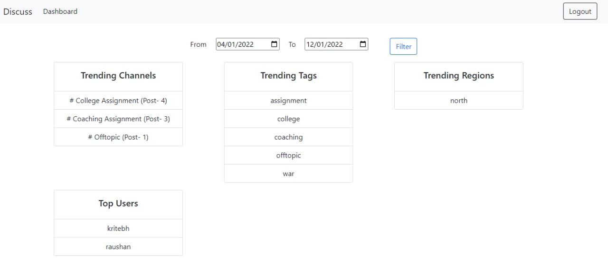
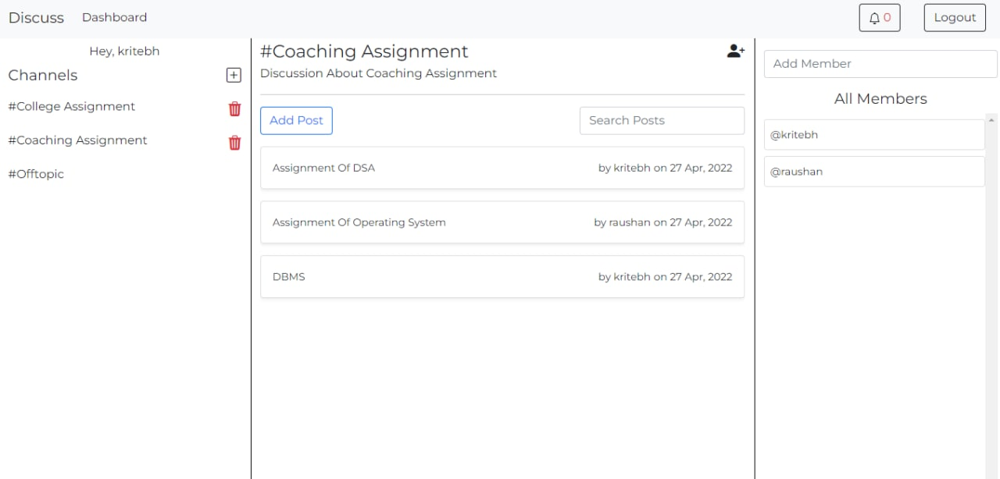

# Discuss App

Discuss app is very similar to Slack, main tech is used are given below -

- Express JS
- Socket.io
- MailJet

## How To Run

First clone this repo and create a `.env` file and it must contains following 8 keys :

- HOST=localhost
- PORT=3000
- CHAT_PORT = 5000
- SECRET = "some secret message"
- MJ_API_KEY = "MAILJET API KEY"
- MJ_API_SECRET = "MAILJET API SECRET"
- SENDER_EMAIL = "Your Email"
- MONGO_URL = "mongodb+srv://username:password......"

After creating `.env` now we are ready to run the project

```javascript
npm install
npm run start

```

## Screenshots -

### Auth





### Dashboard






